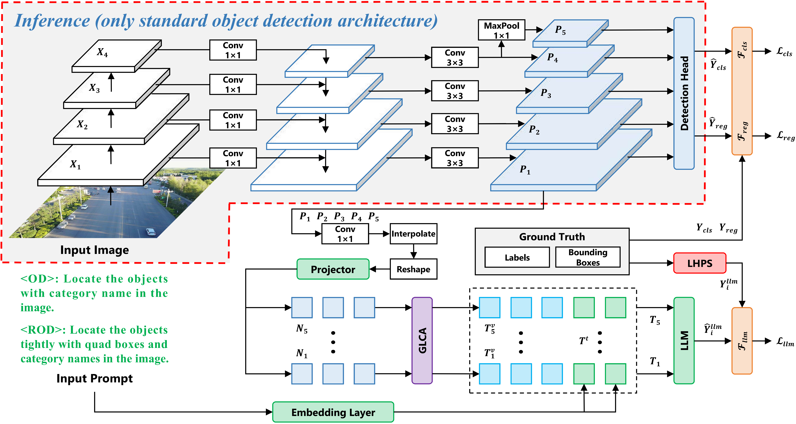

# VLM4RSDet: Collaborative Optimization with Vision-Language Model for Enhancing Remote Sensing Object Detection

This repository is the official implementation of **VLM4RSDet**,  is a novel collaborative training framework that leverages vision-language models to enhance traditional closed-set remote sensing object detectors without introducing any additional deployment overhead.

**[VLM4RSDet: Collaborative Optimization with Vision-Language Model for Enhancing Remote Sensing Object Detection](https://openaccess.thecvf.com/content/CVPR2026/html/Shi_VLM4RSDet_Collaborative_Optimization_with_Vision-Language_Model_for_Enhancing_Remote_Sensing_CVPR_2026_paper.html)** 
</br>
Shuohao Shi, Qiang Fang*, Xin Xu* (*Corresponding Author)
</br>

<div align="center">

</div>

## 🔥 News
- 🚀 **[2026/06/12]** We have updated the VLM4RSDet github repository, and now you can test our model.
- 🚀 **[2026/03/17]** We released the camera-ready version of [VLM4RSDet: Collaborative Optimization with Vision-Language Model for Enhancing Remote Sensing Object Detection](https://openaccess.thecvf.com/content/CVPR2026/html/Shi_VLM4RSDet_Collaborative_Optimization_with_Vision-Language_Model_for_Enhancing_Remote_Sensing_CVPR_2026_paper.html).
- 🚀 **[2026/02/21]** VLM4RSDet has been accepted by CVPR'26.

## Contents
- [Install](#install)
- [Model Zoo](#model-zoo)
- [Dataset](#dataset)
- [Evaluation](#evaluation)


## Install

### Required environments:

-   Linux
-   Python 3.6+
-   PyTorch 1.3+
-   CUDA 9.2+
-   GCC 5+
-   [MMCV](https://mmcv.readthedocs.io/en/latest/#installation)
-   [cocoapi-aitod](https://github.com/jwwangchn/cocoapi-aitod)

### Get started:

Note that this repository is based on the [MMDetection](https://github.com/open-mmlab/mmdetection). Assume that your environment has satisfied the above requirements, please follow the following steps for installation.

    git clone https://github.com/cszzshi/VLM4RSDet.git
    cd VLM4RSDet
    pip install -v -e .

To verify whether MMDetection is installed correctly, we provide some sample codes to run an inference demo.

  **Step 1.** We need to download config and checkpoint files.

    mim download mmdet --config rtmdet_tiny_8xb32-300e_coco --dest .
  
  **Step 2.** Verify the inference demo.
  
    python demo/image_demo.py demo/demo.jpg rtmdet_tiny_8xb32-300e_coco.py --weights rtmdet_tiny_8xb32-300e_coco_20220902_112414-78e30dcc.pth --device cpu

You will see a new image `demo.jpg` on your `./outputs/vis` folder, where bounding boxes are plotted on cars, benches, etc.

## Model Zoo

[🤗Faster R-CNN w/ VLM4RSDet on VisDrone](https://huggingface.co/cszzshi/VLM4RSDet).

[🤗Florence-2-Base](https://huggingface.co/microsoft/Florence-2-base).

## Dataset

The official download link of VisDrone dataset.

 - trainset (1.44 GB): [Baidu Yun](https://pan.baidu.com/s/1K-JtLnlHw98UuBDrYJvw3A) | [Google Drive](https://drive.google.com/file/d/1a2oHjcEcwXP8oUF95qiwrqzACb2YlUhn/view?usp=sharing)

 - valset (0.07 GB): [Baidu Yun](https://pan.baidu.com/s/1jdK_dAxRJeF2Xi50IoML1g) | [Google Drive](https://drive.google.com/file/d/1bxK5zgLn0_L8x276eKkuYA_FzwCIjb59/view?usp=sharing)
## Evaluation

Test the trained weight using 4 GPUs.

```Shell 
CUDA_VISIBLE_DEVICES=0,1,2,3 tools/dist_test.sh configs/VLM4RSDet/visdrone/faster-rcnn_r50_fpn_1x_visdrone.py work_dirs/VLM4RSDet/visdrone/faster-rcnn_r50_fpn_1x_visdrone/epoch_12.pth 4
```

Test the trained weight using a single GPU.

```Shell 
python tools/test.py configs/VLM4RSDet/visdrone/faster-rcnn_r50_fpn_1x_visdrone.py work_dirs/VLM4RSDet/visdrone/faster-rcnn_r50_fpn_1x_visdrone/epoch_12.pth
```


## Citation

Welcome to cite this project in your research.

```
@InProceedings{Shi_2026_CVPR,
    author = {Shi, Shuohao and Fang, Qiang and Xu, Xin},
    title = {VLM4RSDet: Collaborative Optimization with Vision-Language Model for Enhancing Remote Sensing Object Detection},
    booktitle = {Proceedings of the IEEE/CVF Conference on Computer Vision and Pattern Recognition (CVPR)},
    year = {2026},
    pages = {18450-18460}
}
```

## Contact Us
If you are interested in our project or have any questions, please feel free to contact us at any time via email at [shishuohao23@nudt.edu.cn](mailto:shishuohao23@nudt.edu.cn) or [e867cda2b@126.com](mailto:e867cda2b@126.com).

## License
This project is licensed under the [Apache License (Version 2.0)](https://github.com/modelscope/modelscope/blob/master/LICENSE).

## Related Projects
This work wouldn't be possible without the incredible open-source code of these projects.
- [MMDetection](https://github.com/open-mmlab/mmdetection)
- [Florence-2](https://huggingface.co/microsoft/Florence-2-base)
- [cocoapi-aitod](https://github.com/jwwangchn/cocoapi-aitod)
